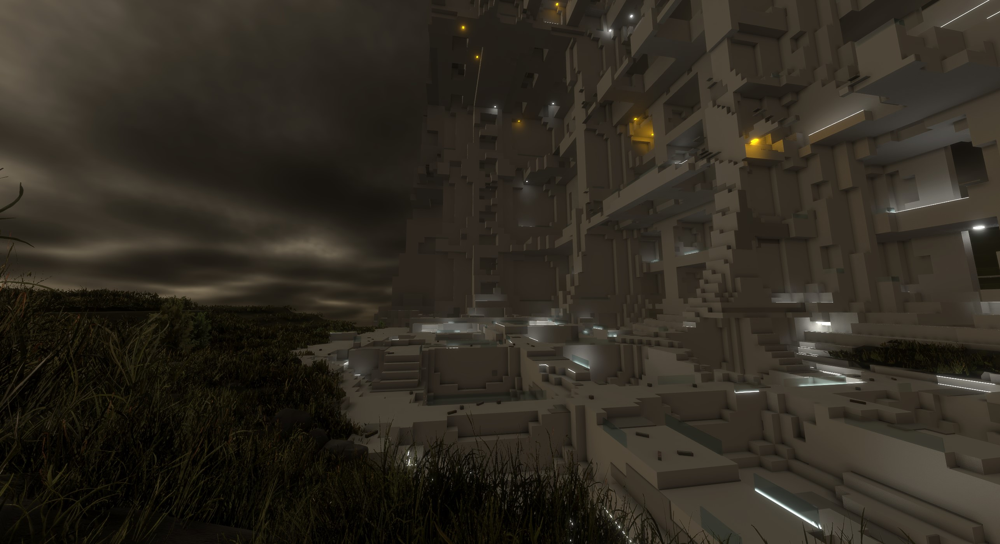

<h1>INFINITRA Project</h1>

**A Limitless Virtual Reality Universe**

## Table of Contents

- [Introduction](#introduction)
- [Features](#features)
- [Upcoming Features](#upcoming-features)
- [System Requirements](#system-requirements)
- [Installation and Setup](#installation-and-setup)
- [Controls](#controls)
- [Contributing](#contributing)
- [Legal and Licensing](#legal-and-Licensing)
- [Impressions](#impressions)

---

## Introduction

**INFINITRA** is a groundbreaking shared universe that offers limitless exploration and immersive experiences with virtual reality support. Developed using advanced CPU and GPU technology with Unity, it presents intricate fractal landscapes and dynamic environments, pushing the boundaries of what's possible in virtual reality.

**Note:** INFINITRA is currently in an **early Alpha stage**. We are continuously expanding and improving the universe, and your participation and feedback are crucial to its development.

---

## Features

- **Infinite Exploration:** Traverse an endless virtual world with vast, procedurally generated terrains and structures.
- **Procedural Fractals:** Experience unique, ever-changing fractal environments that provide a new experience every time.
- **Multiplayer Adventures:** Connect with friends or other explorers in real-time shared world mode.
- **Item Collection and Inventory:** Collect unique items throughout your journey and manage them in your inventory.
- **Customizable Characters:** Personalize your avatar.
- **VR and Non-VR Compatibility:** Play in full VR for immersive experiences or on a traditional screen.
- **Enhanced Movement Mechanics:** Utilize VR movement features such as snap-turning and teleportation for seamless exploration.
- **Optimized Performance:** Enjoy smooth gameplay with efficient background processing and optimized resource management.
- **Enhanced Visuals:** Experience improved voxel graphics with additional objects, clouds and terrain models.

---

## Upcoming Features

We're actively working on expanding INFINITRA with the following planned enhancements:

- **Object Trading System:** Trade items with other explorers in shared world mode to enhance your collection.
- **World Modification Tools:** Modify and create new persisting structures within the environment.
- **Region Ownership:** Claim and customize areas within the universe.
- **Advanced Visuals:** Ongoing improvements to graphics and content for a richer experience.
- **Enhanced Interactions:** Introducing puzzles, challenges, and new activities for deeper engagement.
- **Cross-Platform Releases:** Expanding support to Linux and Mac systems.

---

## System Requirements

To fully enjoy INFINITRA, we recommend the following system specifications:

- **Operating System:** Windows 10 or later
- **Processor:** AMD Ryzen 9 7900 or equivalent
- **Graphics:** NVIDIA GeForce RTX 4060 Ti OC or equivalent
- **Memory:** 16 GB RAM or more
- **Storage:** At least 2 GB of free space
- **VR Headset:** Strongly recommended (i.e. OpenXR compatible)

---

## Installation and Setup

### Download

- **Latest Release:** [Download INFINITRA](https://github.com/richardbogad/INFINITRA/releases)

### Installation Steps

1. **Download the Software:**
    - Choose the appropriate installer for your system from the releases page.
2. **Run the Executable:**
    - For EXE files, double-click to run the software.
    - For ZIP files, extract the contents and run `infinitra.exe`.

### Account Creation

- **Guest Access:**
    - Launch the game and explore anonymously with limited features.
- **Registered Access:**
    - Create an account to save your progress and access additional features like more complex structures, item collection, and avatar customization.
- **INFINITRA Subscription:**
    - Support development and access exclusive features, helping us maintain servers and expand the universe.

---

## Controls

### 2D Controls

- **Menu:** `Escape` key
- **Movement:** `W` `A` `S` `D` keys
- **Jump:** `Spacebar`
- **Crouch:** `Left Alt`
- **Collect Items:** `C` key
- **Inventory:** `I` key

### VR Controls

- **Moving, Teleportation, Turning:** Utilize the thumbstick or touchpad of your VR controllers.
- **Menu, Jump, Crouch:** Use the corresponding buttons of your VR controllers.

*Note: Customizable input bindings are coming soon.*

---

## Contributing

We welcome contributions from the community to help shape INFINITRA.

NOTE:
At this early stage, the main logic of INFINITRA is implemented in a core DLL.
We plan to introduce interfaces soon to allow users to add modular, custom content.

### How to Contribute:

1. **Fork the Repository:** Click on the 'Fork' button at the top right of the GitHub page.
2. **Clone Your Fork:** Use `git clone` to clone your forked repository to your local machine.
3. **Install Unity:** Download and install [Unity Hub](https://unity.com/download) and the required Unity version.
4. **Set Up the Project:**
    - Open the INFINITRA project in Unity.
    - Install FirebaseAuth 12.1 and FirebaseFirestore 12.1 from [Firebase Unity SDK](https://github.com/firebase/firebase-unity-sdk/releases).
    - Include `InfinitraCore.dll` and `google-services.json` from the latest release.
5. **Add packages**
    - Add `geometry4Sharp` library from [GitHub](https://github.com/NewWheelTech/geometry4Sharp) for mesh computations.
    - Import Unity Asset 'Street Props - Prototype Collection' [link](https://assetstore.unity.com/packages/3d/props/street-props-prototype-collection-291021)
    - Import Unity Asset 'Rock_Pack' [link](https://assetstore.unity.com/packages/3d/environments/landscapes/rock-pack-210536)
    - Import Unity Asset 'The Toby Foliage Engine / Light' [link](https://assetstore.unity.com/packages/vfx/shaders/the-toby-foliage-engine-light-282901)
6. **Make Your Changes:** Implement new features, fix bugs, or improve documentation.
7. **Testing:** Ensure your changes do not break existing functionality.
8. **Submit a Pull Request:** Once your changes are ready, submit a pull request for review.

---

## Legal and Licensing

- **Terms of Service:** [View Terms](TERMS.md)
- **Copyright:** [View Copyright](COPYRIGHT.md)
- **End User License Agreement:** [View EULA](EULA.md)
- **No Refund Policy:** [View Policy](NOREFUND.md)
- **Privacy Policy:** [View Privacy](PRIVACY.md)
- **Source Code License:** [View License](LICENSE.txt)

---

## Impressions

Join INFINITRA today and be part of a universe where the only limit is your imagination!
