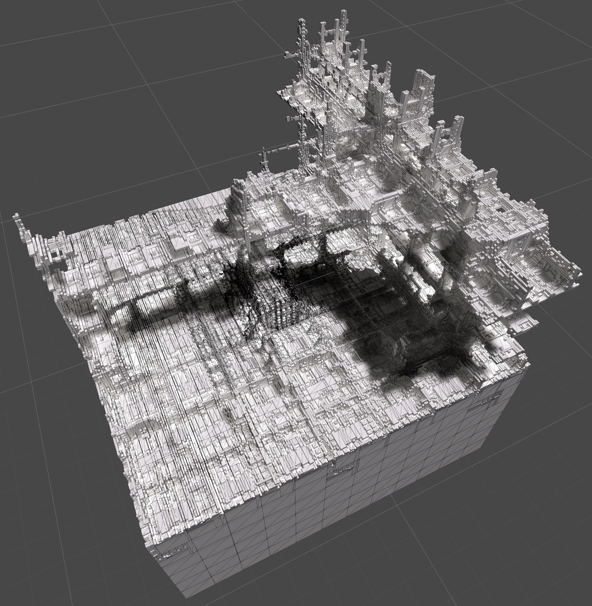

INFINITRA Project
=================

Welcome to the INFINITRA project repository, where you can explore a virtual reality world that extends beyond the horizons, crafted to let your curiosity roam free in an infinite structure.

INFINITRA is a passion project born from a childhood dream, enhanced by the latest CPU and GPU technology advancements. Developed using the Unity engine, it utilizes intricate fractal geometry and dynamic environments to deliver an immersive experience.

Encountered an issue? Report it [here](https://github.com/richardbogad/INFINITRA/issues).

Join discussions and contribute ideas on our [community forum](https://github.com/richardbogad/infinitra/discussions).

Prerequisites
-------------
- Windows Operating System
- AMD Ryzen 9 7900 CPU or equivalent
- GeForce RTX 4060Ti OC GPU or equivalent
- VR Headset (recommended)

Playing Quickstart
----------
Experience the demo of INFINITRA, currently available for Windows architectures.

- [Download](https://github.com/richardbogad/infinitra/releases/) the latest compiled release and extract the ZIP file.
- Execute 'infinitra.exe' from the extracted folder.
- If you're not using a VR Headset, navigate using WASD keys, jump or fly with SPACE + N, and crouch with SPACE + B.

Setup Development Environment
-----------------------------
- [Download](https://github.com/richardbogad/INFINITRA/archive/master.zip) the repository and extract the ZIP file.
- [Download](https://unity.com/download) and install Unity Hub, open the extracted INFINITRA project folder.

How to Contribute
-----------------
Your insights and improvements can help shape the future of INFINITRA. Join us in refining and expanding this infinite virtual universe.

**To get started:**
- Fork the project by clicking the **Fork button**.
- [Set up Git](https://help.github.com/articles/set-up-git) and sync the project to your computer.
- Modify the source code and validate your changes.
- Send your improvements via a [Pull Request](https://help.github.com/articles/using-pull-requests).

Common Issues
-------------
**Feature Requests or Bugs:**
Open an issue on our [GitHub page](https://github.com/richardbogad/INFINITRA/issues) if you have suggestions or encounter bugs.

This version includes a general description, imagery references, and essential details, structured to fit within the streamlined README format appropriate for a GitHub repository.