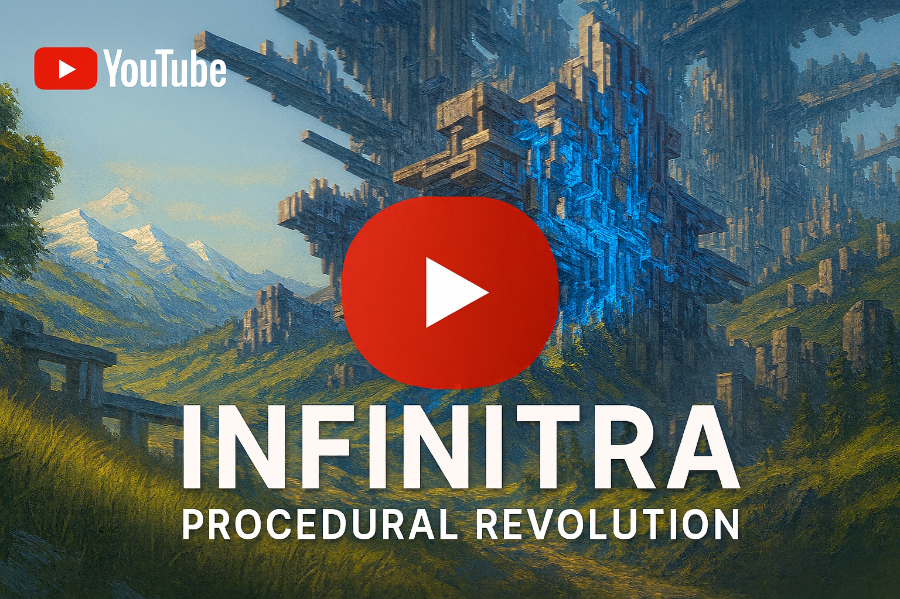
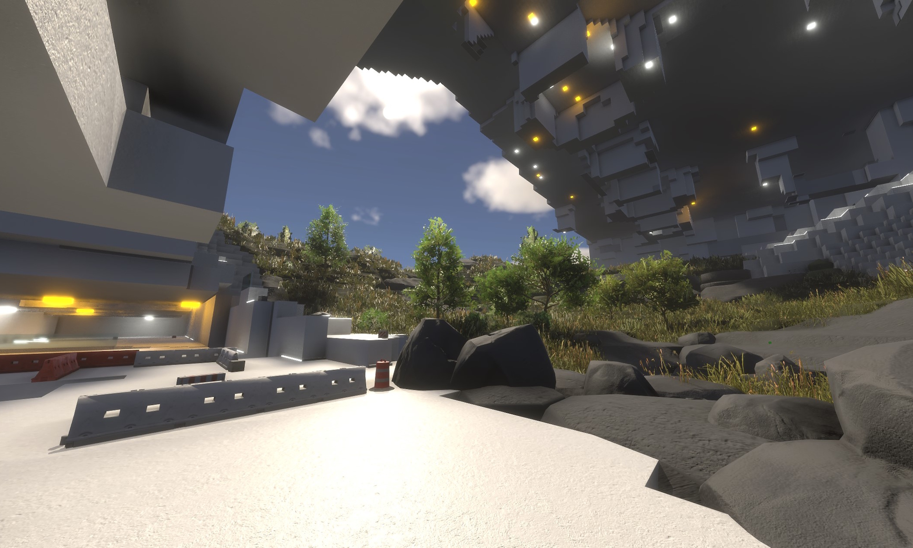
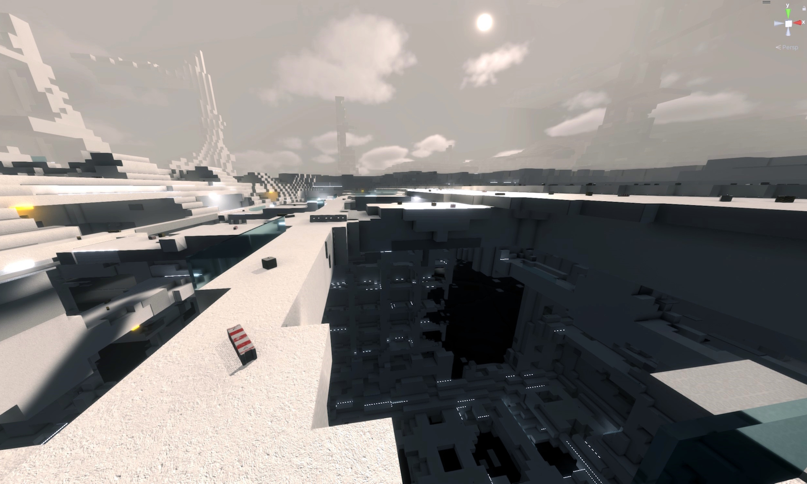
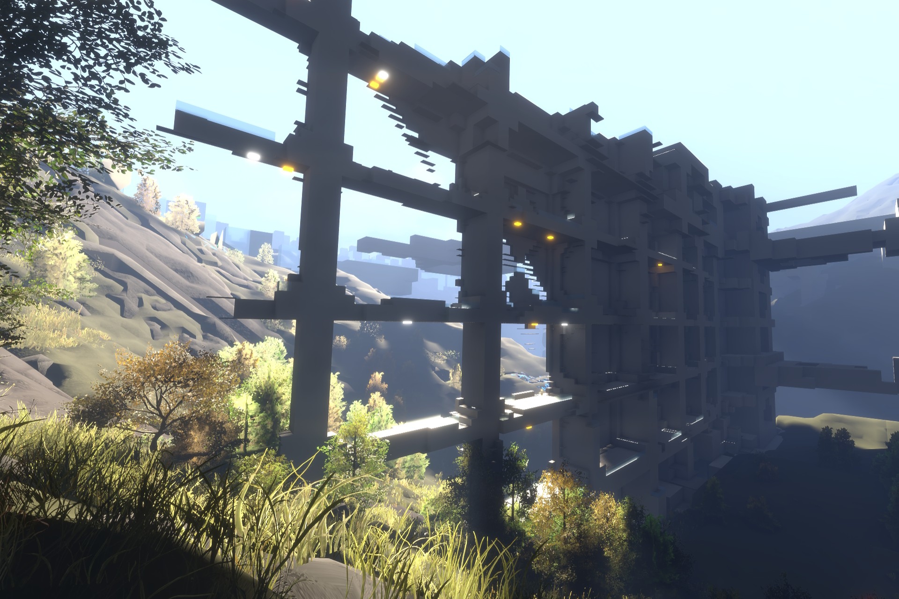
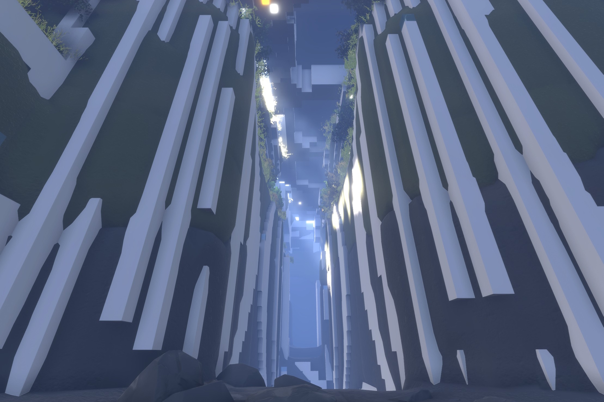
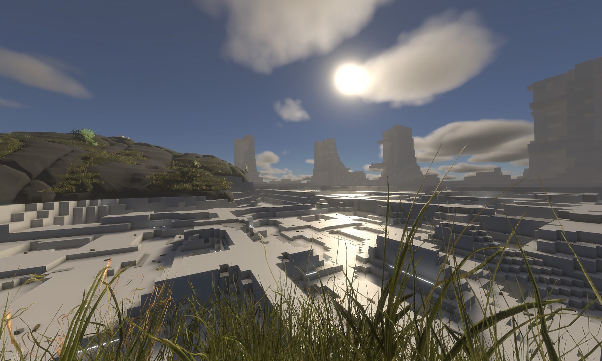
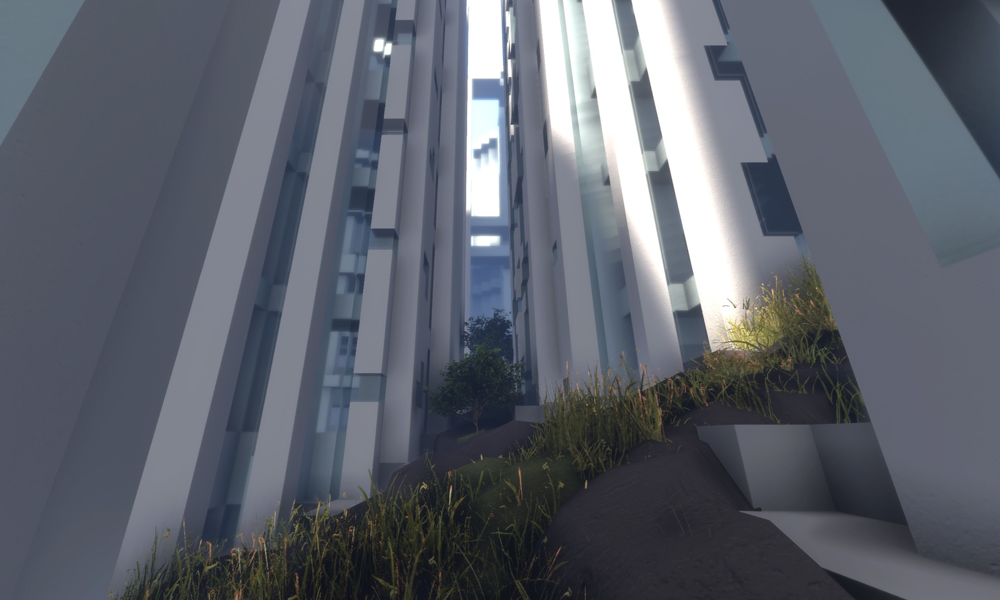
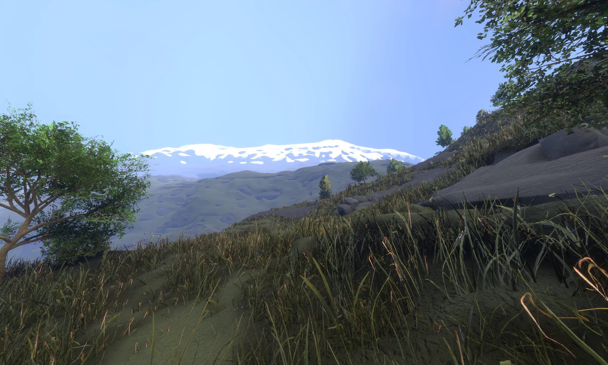

  

<h1>INFINITRA</h1>

**Dare to Explore a Universe Born from Mathematics.**

  
  

  
  
  

[See More From the Frontier](#impressions)

  

## Table of Contents

- [Welcome to the Frontier](#welcome-to-the-frontier)
- [A Journey into the Unknown](#a-journey-into-the-unknown)
- [Core Features](#core-features)
- [The Unwritten Roadmap](#the-unwritten-roadmap)
- [Installation and Setup](#installation-and-setup)
- [Account Tiers and Registration](#account-tiers-and-registration)
- [Controls](#controls)
- [System Requirements](#system-requirements)
- [For Developers: Contributing](#for-developers-contributing)
- [Impressions](#impressions)
- [Legal and Licensing](#legal-and-licensing)

---

## Welcome to the Frontier

**INFINITRA** is not just a game; it's a procedurally generated shared universe of incomprehensible scale, designed for limitless exploration in VR and on-screen.

Forget hand-crafted maps. Every mountain range, sprawling city, subterranean tunnel, and alien fractal structure you discover is born from a complex chain of mathematical formulas. This creates a seamless world stretching for **10 trillion kilometers**, where every vista can be a first discovery.

Step into a world where exploration is real, the scale is mind-bending, and the horizon is always expanding.

---

## A Journey into the Unknown

**INFINITRA is in Early Access.** We are embarking on a monumental experiment: to build a persistent, procedurally generated universe on a scale that has never existed before, visitable by millions of users.

This is uncharted territory. A project this ambitious means the future is unwritten. We don't know exactly where this journey will lead or how gameplay will evolve in such a massive, shared space—and that is the most exciting part.

**This is where you come in.** As an early pioneer, you are more than a player; you are a co-explorer helping to shape the future of this cosmos. We are building this with you and for you. We are incredibly curious to hear your ideas, feature requests, and wildest suggestions. What do you want to do in a universe this big?

Help us figure it out. Join the [**Discussions**](https://github.com/richardbogad/INFINITRA/discussions) and be part of the conversation.

To fund the server infrastructure and our continued development, we invite you to **support the project with a subscription.** Subscribers gain access to extended features - see below for more information.

---

## Core Features

-   **A Truly Infinite Universe:** Explore a seamless world that spans trillions of kilometers. Travel across vast procedural terrains, delve into deep tunnel systems, and ascend to towering fractal cities in the sky.
-   **Worlds Born from Math:** Experience a universe where every location is unique. The procedural generation engine ensures that your discoveries are your own.
-   **Shared Exploration:** You are not alone. Connect with other explorers in real-time to share in the discovery of new and wondrous sights. (Note: Seeing other players requires a subscription).
-   **Shape Your Reality:** Find, collect, and use powerful items. Heal yourself with a health kit, soar through the skies with a Jetpack, save your favorite discoveries with a Location Saver, or even alter the world with Carver Items.
-   **Full VR & Desktop Support:** Immerse yourself completely with a compatible OpenXR headset and motion controls, or explore from a traditional desktop PC.

---

## The Unwritten Roadmap

Our roadmap is a living document, guided by the possibilities of the engine and the desires of our community. While the ultimate destination is unknown, here are some of the landmarks we aim to build along the way. Your feedback will help us prioritize these and discover new ones.

-   **Player-Driven Worlds:** Gain tools to permanently modify the environment, creating your own structures and outposts.
-   **A Living Economy:** An item trading system to allow a player-driven marketplace to emerge.
-   **Deeper Interaction:** Unravel mysteries with complex puzzles and challenges hidden within the procedural generation.
-   **Claim Your Space:** The ability to claim and own persistent regions of the world.
-   **Conflict and Cooperation:** Introduce mechanisms that allow for more direct player interaction, from defending territory to collaborative building.
-   **Expanding the Cosmos:** Grow the universe to even more mind-boggling scales and introduce new, reality-bending procedural systems.

---

## Installation and Setup

### Download

-   **Latest Early Access Release:** [**Download INFINITRA**](https://github.com/richardbogad/INFINITRA/releases)

### Installation Steps

1.  **Download:** Grab the latest release from the link above.
2.  **Run:**
    -   If you downloaded an `.exe` file, simply double-click to run it.
    -   If you downloaded a `.zip` file, extract its contents and run `infinitra.exe`.

---

## Account Tiers and Registration

You can create an account and manage your subscription directly **within the INFINITRA software.**

-   **Guest:** Launch the game and explore the universe solo in offline mode. No account needed.
-   **Registered User (Free):** Create a free account **inside the game** to have your last visited location saved.
-   **Subscriber:** **Support the grand experiment!** A subscription helps us pay for servers and build the future of INFINITRA. As a thank you, subscribers unlock key features like the ability to see other players exploring the world, using items and your inventory, and storable locations.

---

## Controls

### Desktop Controls

| Action        | Key             |
|:--------------|:----------------|
| **Menu** | `Escape`        |
| **Move** | `W` `A` `S` `D` |
| **Jump** | `Spacebar`      |
| **Crouch** | `Left Alt`      |
| **Collect** | `C`             |
| **Activate** | `A`             |
| **Inventory** | `V`             |
| **Item Info** | `I`             |

### VR Controls

-   **Movement:** Use the thumbstick/touchpad for smooth locomotion or teleportation.
-   **Actions:** Use the primary buttons on your VR controllers for Menu, Inventory, Jump, and Crouch.
-   **Interaction:** Point at items and use the trigger & grab buttons to activate & collect them.

*Note: Customizable input bindings are a planned feature.*

---

## System Requirements

This is an Early Access build, and performance optimizations are ongoing. For the best experience, we recommend:

-   **OS:** Windows 10 or later
-   **Processor:** AMD Ryzen 9 7900 or equivalent
-   **Graphics:** NVIDIA GeForce RTX 4060 Ti or equivalent
-   **Memory:** 16 GB RAM
-   **Storage:** 2 GB free space
-   **VR (Recommended):** An OpenXR-compatible headset

---

## For Developers: Contributing

We welcome community contributions to help shape INFINITRA.

**NOTE:** The core logic is currently in proprietary DLLs (`Infinitra.Core.dll` and `Infinitra.Shared.dll`). We plan to introduce a formal API/SDK to allow for modular, user-created content in the future.

### How to Contribute

1.  **Fork & Clone:** Fork the repository and clone it to your local machine.
2.  **Unity Setup:**
    -   Install [Unity Hub](https://unity.com/download).
    -   Open the cloned project in Unity Hub; it will prompt you to install the correct Unity Editor version.
    -   From the latest GitHub Release, place `Infinitra.Core.dll`, `Infinitra.Shared.dll`, and `google-services.json` into the correct project directories.
3.  **Firebase SDK:**
    -   Download and import the Firebase Unity SDK `FirebaseAuth` and `FirebaseFirestore` version 12.10.
4.  **Additional Assets:**
    The project utilizes several external libraries and assets:
    - Add `geometry4Sharp` library from [GitHub](https://github.com/NewWheelTech/geometry4Sharp) for mesh computations.
    - Import Unity Asset 'Street Props - Prototype Collection' [link](https://assetstore.unity.com/packages/3d/props/street-props-prototype-collection-291021)
    - Import Unity Asset 'Rock_Pack' [link](https://assetstore.unity.com/packages/3d/environments/landscapes/rock-pack-210536)
    - Import Unity Asset 'The Toby Foliage Engine / Light' [link](https://assetstore.unity.com/packages/vfx/shaders/the-toby-foliage-engine-light-282901)
    - Import Unity Asset 'Free High-Poly Drone' [link](https://assetstore.unity.com/packages/3d/characters/robots/free-high-poly-drone-231255)
    - Import Unity Asset 'Banana Man' [link](https://assetstore.unity.com/packages/3d/characters/humanoids/banana-man-196830)
    - Import Unity Asset 'HDRP Dissolve' [link](https://assetstore.unity.com/packages/vfx/shaders/directx-11/hdrp-dissolve-192055)
    - Import Unity Asset 'Basic Motions FREE' [link](https://assetstore.unity.com/packages/p/basic-motions-free-154271)
    - Import Unity Asset 'Human Melee Animations FREE' [link](https://assetstore.unity.com/packages/3d/animations/human-melee-animations-free-165785)
    - Import Unity Asset 'Surface Gradient Bump Mapping Samples' (without Project Settings) [link](https://assetstore.unity.com/packages/templates/tutorials/surface-gradient-bump-mapping-samples-240786)
    - Import Unity Asset 'House Interior - Free' [link](https://assetstore.unity.com/packages/3d/props/interior/house-interior-free-258782)
    - Import Unity Asset 'Simple Gems and Items Ultimate Animated Customizable Pack' [link](https://assetstore.unity.com/packages/3d/props/simple-gems-and-items-ultimate-animated-customizable-pack-73764)
5.  **Build & Test:** Implement your features or fixes and ensure they don't break existing functionality.
6.  **Pull Request:** Submit a pull request with a clear description of your changes.

---

## Impressions

---

## Legal and Licensing

Your use of the INFINITRA software, website ([www.infinitra.xyz](https://www.infinitra.xyz)), accounts, and related services ("Service") signifies your agreement to the following legal documents. Please review them carefully:

-   **[Terms of Service](TERMS.md):** The main agreement governing your use of the Service, including accounts, subscriptions, rules of conduct, and liability limitations.
-   **[EULA](EULA.md):** The license terms specifically for downloading, installing, and using the INFINITRA software application.
-   **[Privacy Policy](PRIVACY.md):** Explains how we collect, use, and protect your personal data in compliance with GDPR and other applicable laws.
-   **[License](LICENSE.md):** Details the dual-licensing model: MIT license for designated open-source files and proprietary restrictions (governed by EULA/Terms) for `Infinitra.Core.dll`, `Infinitra.Shared.dll`, and the software overall.
-   **[Copyright Notice](COPYRIGHT.md):** Information regarding copyright ownership.
-   **[Legal Disclosure](LEGAL_DISCLOSURE.md)**

By accessing or using the Service, you agree to be bound by the Terms of Service, EULA, and Privacy Policy.

Copyright © 2025 Richard Bogad Solutions. All rights reserved.

**[Impressum](LEGAL_DISCLOSURE_DE.md)** |
**[Datenschutzerklärung](PRIVACY_DE.md)** |
**[Allgemeine Geschäftsbedingungen](TERMS_DE.md)**

