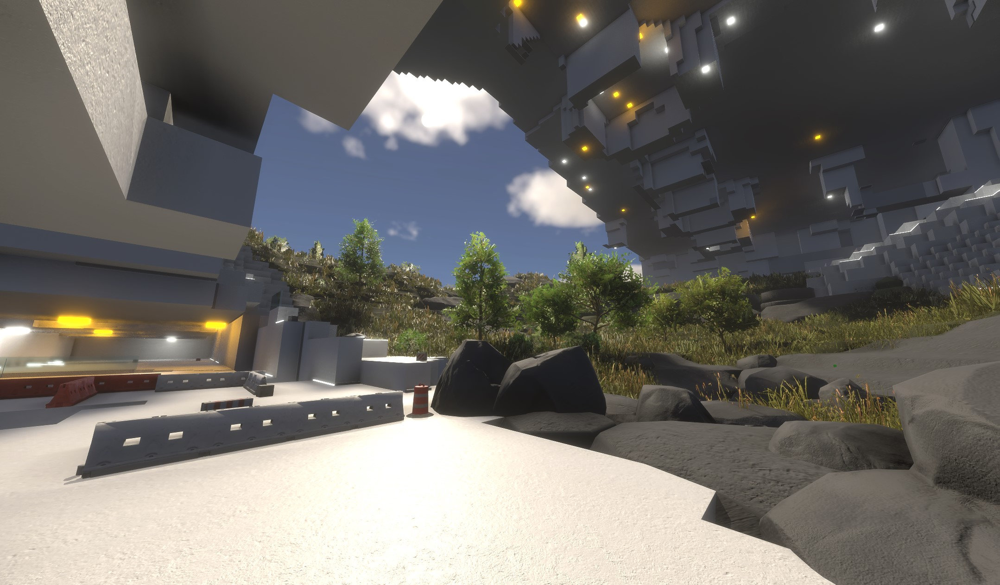
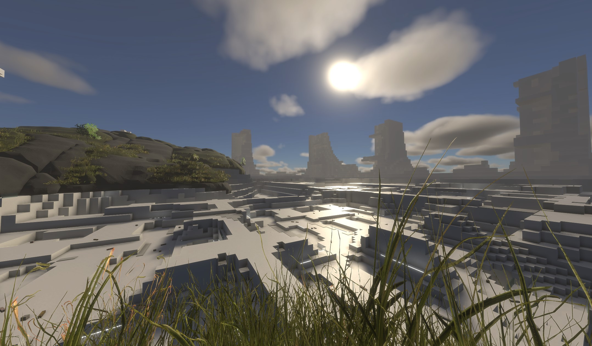
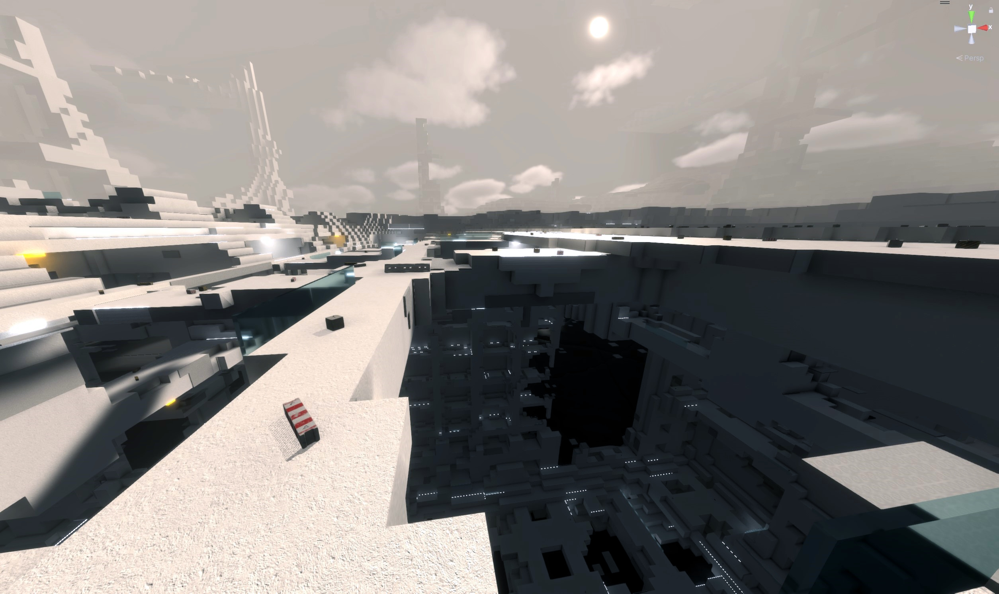
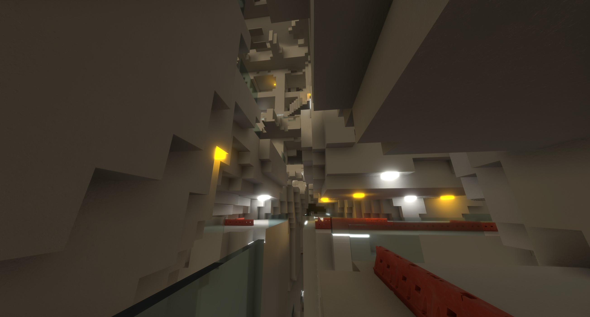

<h1>INFINITRA Project</h1>

**Welcome to INFINITRA**, a limitless virtual reality universe where your imagination takes flight. Built with cutting-edge CPU and GPU technology and developed on Unity, INFINITRA invites you on an extraordinary journey through intricate fractal landscapes and dynamic environments, offering a truly immersive experience.

**Need Help?** [Report Issues](https://github.com/richardbogad/INFINITRA/issues)

**Join Us:** [Community Forum](https://github.com/richardbogad/infinitra/discussions)

Introduction
------------

**INFINITRA** was born from an unexpected event—an alien encounter and the discovery of a futuristic data device containing a game from Earth in 2124. We've adapted part of its code to C# to bring this early version to you. While some features are limited due to the advanced hardware it requires, INFINITRA is now available for you to explore and shape with your feedback.

**Note:** INFINITRA is in a **very early Alpha stage**. This is the beginning of a dynamic, ever-expanding universe. Your participation is key to bringing this vision to life!

Features
--------

Dive into a universe where technology meets imagination, crafted for explorers like you. The future is here—are you ready to explore?

- **Infinite Exploration:** Roam an endless virtual world with vast terrains to discover. The journey never ends, and the mysteries are infinite.

- **Procedural Fractals:** Marvel at endlessly generating fractals that create a unique, ever-changing world.

- **Multiplayer Adventures:** Join forces with friends or other explorers in real-time to create memorable experiences together.

- **Customizable Characters:** Choose a unique identity with customizable avatars, animations, and sounds.

- **Dynamic World:** Every action affects the world around you. Experience real-time changes and interactions.

- **VR and 2D Compatibility:** Whether in full VR immersion or on a traditional screen, play your way.

- **Enhanced Movement:** Utilize VR movement mechanics like snap-turning and teleportation for dynamic exploration.

- **Optimized Performance:** Smooth gameplay and efficient background processing for a seamless experience.

Upcoming Enhancements
---------------------

We're just beginning to expand INFINITRA. Here's a look at what's coming:

- **Unique Objects:** Find and trade rare items, each with its own story.

- **Modifiable World:** Shape the landscape to your liking by modifying and creating new structures.

- **Region Ownership:** Claim and customize your own areas within the world.

- **Improved Visuals:** Expect stunning graphics and richer content updates.

- **Next-Level Interactions:** Solve puzzles, explore more, and discover new relaxation and adventure opportunities.

Account Options
---------------

- **Guest Access:** Enter anonymously with temporary access; ideal for single-player exploration without saving progress.

- **Registered Access:** Save your progress and customizations for continued adventures.

- **Infinite Subscription:** Support development and access exclusive features, helping INFINITRA grow and maintain its servers and keep the universe alive!

System Requirements
-------------------

Due to advanced calculations and graphics, a powerful computer is recommended:

- **OS:** Windows
- **CPU:** AMD Ryzen 9 7900 or equivalent
- **GPU:** GeForce RTX 4060Ti OC or equivalent
- **VR Headset:** Highly recommended for full immersion

Getting Started
---------------
**Try the INFINITRA Demo:** Get a glimpse of the universe.

- **Download:** [Latest Release](https://github.com/richardbogad/infinitra/releases/)
- **Install:** Extract the ZIP file and run 'infinitra.exe'.
- **Controls:** Use WASD to move, SPACE to jump/fly, ALT to crouch, ESC for the menu.

**Upcoming:** 
- Customizable input features to enhance your gameplay.
- Releases for other systems like Linux and Mac.

Contribute to INFINITRA
-----------------------

**Help Build the Universe:** Your creativity and skills can shape INFINITRA.

**Get Involved:**
- **Fork:** Start by forking the GitHub repository.
- **Setup:** Use the [Git Setup Guide](https://help.github.com/articles/set-up-git) to sync your local repository.
- **Collaborate:** Submit changes via [Pull Requests](https://help.github.com/articles/using-pull-requests) and join the community effort.

Development Setup
-----------------

- **Download:** [Repository ZIP](https://github.com/richardbogad/INFINITRA/archive/master.zip)
- **Install Unity Hub:** [Unity Hub](https://unity.com/download) and open the INFINITRA project.
- **Add Firebase Modules:** Install FirebaseAuth 12.1 and FirebaseFirestore 12.1 from [GitHub](https://github.com/firebase/firebase-unity-sdk/releases).
- **Include Libraries:** Add InfinitraCore.dll and google-services.json from the latest release.
- **Geometry Calculations:** Add geometry4Sharp from [GitHub](https://github.com/NewWheelTech/geometry4Sharp) for advanced fractal computations.

Support and Feedback
--------------------
**Have Questions or Feedback?**
- **Report Issues:** [Infinitra GitHub](https://github.com/richardbogad/INFINITRA/issues)
- **Contact Us:** [Email Us](mailto:infinitra.world@gmail.com)

Legal and Licensing
-------------------
- **Terms of Service:** [View Terms](TERMS.md)
- **Copyright:** [View Copyright](COPYRIGHT.md)
- **End User License Agreement:** [View EULA](EULA.md)
- **No Refund Policy:** [View Policy](NOREFUND.md)
- **Privacy Policy:** [View Privacy](PRIVACY.md)
- **Source Code License:** [View License](LICENSE.txt)

Impressions
-----------

Join INFINITRA today and be part of a universe where the only limit is your imagination!
